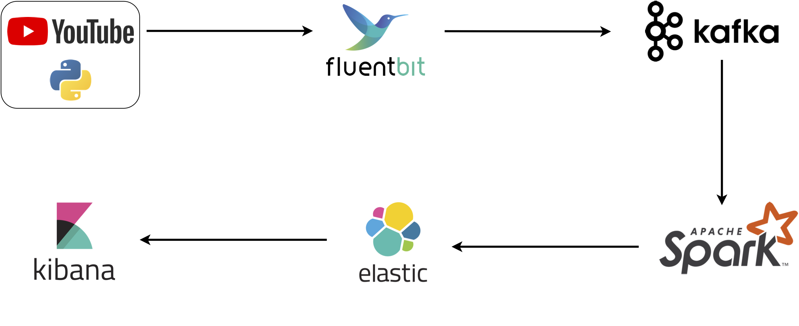

# Progetto di regressione lineare per predire la posizione di video nelle playlist su YouTube

Questo progetto utilizza diverse tecnologie per raccogliere dati da una playlist di canzoni su YouTube e allenare un modello di regressione lineare per predire la posizione dei video in base al titolo e al numero di visualizzazioni. Le tecnologie principali utilizzate sono:

##  Youtube API
Le API di YouTube forniscono un accesso diretto ai dati aggiornati dei video, consentendo di raccogliere informazioni come il titolo e il numero di visualizzazioni in tempo reale, con un aggiornamento frequente dei dati che consente di lavorare con informazioni sempre aggiornate.

##  FluentBit
*"Fluent Bit is a super fast, lightweight, and highly scalable logging and metrics processor and forwarder. It is the preferred choice for cloud and containerized environments."*

##  Apache Kafka
*"Apache Kafka is an open-source distributed event streaming platform used by thousands of companies for high-performance data pipelines, streaming analytics, data integration, and mission-critical applications"*

##  Apache Spark
*"Apache Spark™ is a multi-language engine for executing data engineering, data science, and machine learning on single-node machines or clusters."*

##  Elasticsearch
*"Elasticsearch is a distributed, RESTful search and analytics engine capable of addressing a growing number of use cases. As the heart of the Elastic Stack, it centrally stores your data for lightning fast search, fine‑tuned relevancy, and powerful analytics that scale with ease."*

##  Kibana
*"Run data analytics at speed and scale for observability, security, and search with Kibana. Powerful analysis on any data from any source, from threat intelligence to search analytics, logs to application monitoring, and much more."*

## Pipeline



## How to use

```shell
$ git clone https://github.com/Mancisee/geosounds
$ cd ytPrediction
$ docker compose up
```
1. Monitora l'output del terminale per assicurarti che tutti i servizi si avviano correttamente senza errori.
2. Una volta che il progetto è in esecuzione, puoi accedere a Kibana tramite il tuo browser all'indirizzo `http://localhost:5601` per vedere le dashboard.


